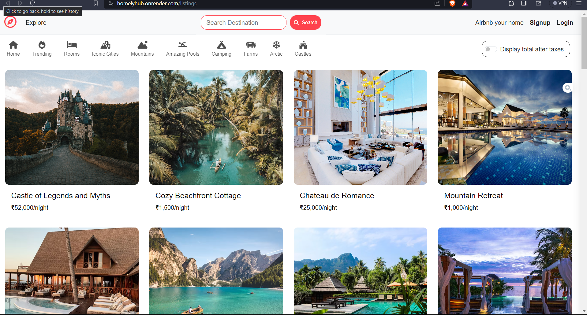

# HomelyHub Project

## Overview

Welcome to my WonderLust project! This full-stack application. It allows users to search for accommodations, view property details, book stays, and much more. The project was built using Node.js and several other technologies.

## Features

- User Registration
- UserAuthentication
- User Reviews
- User Ratings
- Interactive Maps
- and more...

## Tech Stack

This project was developed using a variety of technologies and frameworks, including:

- JavaScript
- HTML
- CSS
- Node.js
- Express.js
- MongoDB
- ejs
- and more...

## Screenshort

 
